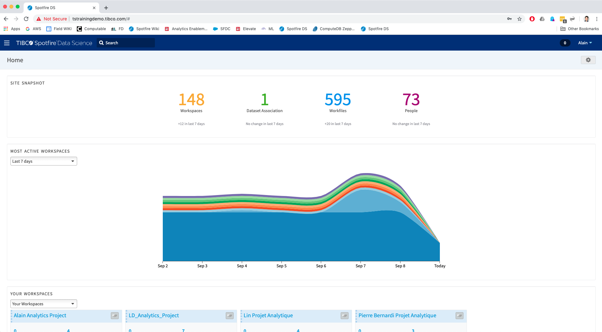
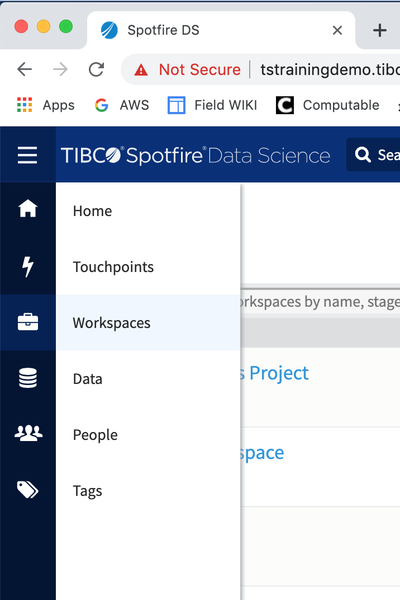
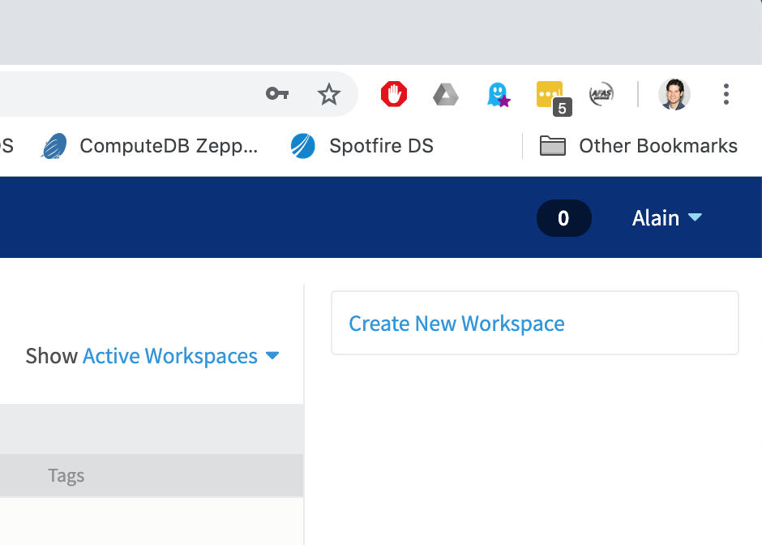
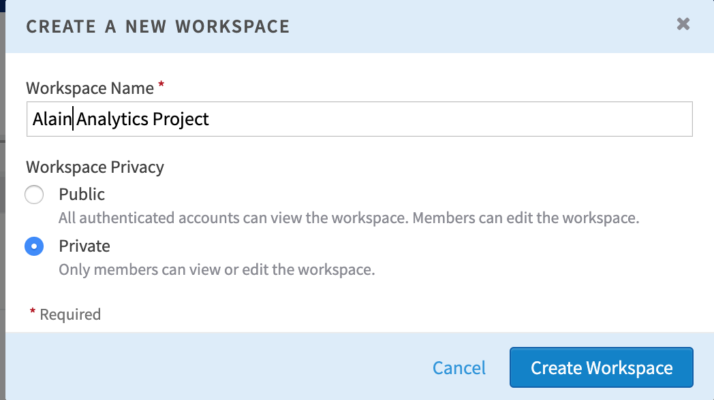
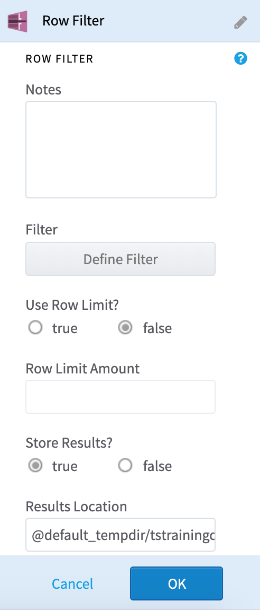
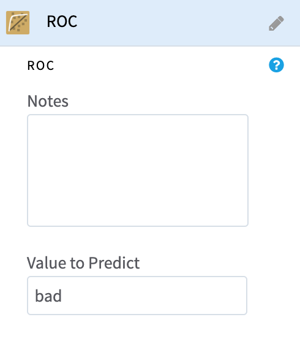

# Workshop TIBCO Data Science

[Table Of Contents]
   * [Workshop TIBCO Data Science](#workshop-tibco-data-science)
      * [Introduction](#introduction)
         * [Authors](#authors)
         * [Problem Statement](#problem-statement)
      * [Lab Guide](#lab-guide)
         * [Prepare your TIBCO Data Science Workspace](#prepare-your-tibco-data-science-workspace)
         * [Perform data preparation](#perform-data-preparation)
         * [Create various data science models](#create-various-data-science-models)
         * [Apply the best predictive model to new loan requests](#apply-the-best-predictive-model-to-new-loan-requests)
         * [Export model for Real Time scoring](#export-model-for-real-time-scoring)
      * [Summary](#summary)
      * [Additional Resources](#additional-resources)

## Introduction

### Authors
[Steven van der Kroft](mailto:svanderk@tibco.com) \
[Alain Martens](mailto:amartens@tibco.com)

Click here to learn about TIBCO

Learn all about TIBCO on our website:
[www.tibco.com](https://www.tibco.com/)

Additional info can be found the TIBCO Community:
[community.tibco.com](https://community.tibco.com/)

### Problem Statement

You work as a citizen data scientist for an insurance company called Augment Insurance. Augment Insurance sells home loans. The company wants to offer loans to people that are creditworthy to mitigate it's risk by determining if an applicant will default on its loan. The challenge is that the company has a hard time determining who to offer a loan and who's loan request should be rejected.

For this reason your manager asked you if you can automate this decision making process. \
 \
To do so you decide to create a predictive model using Machine Learning which allows you to automatically predict if a new loan requests should be accepted by the company. 

The risk management department has collected a data set with historic loan requests with various characteristics of the applicant including the fact if the applicant has defaulted on its loan.

Some key questions you're asked to find the answers to are:
*   Is the data fit for ML?
*   Which ML technique generates the best predictive model?
*   Can we apply the ML model to new loans?
*   Which applicant characteristics have the most predictive power?

In order to perform these tasks you've been given 2 things: Data and TIBCO Data Science.  \
 \
The steps we'll take together are: 
1. Prepare your TIBCO Data Science Workspace
2. Perform data preparation
3. Create various data science models
4. Apply the best predictive model to new loan requests
5. Export model for Real Time scoring

Along the way we'll explore TIBCO Data Science and you'll get familiar with various powerful Data Science features. 

Good luck and feel free to ask any questions you might have along the way!

## Lab Guide
### Prepare your TIBCO Data Science Workspace
In this chapter you'll complete your user profile and prepare workspace to contain all the assets we'll create and use for our analytics project.

1. Log in to [TIBCO Data Science](http://tstrainingdemo.tibco.com/) using the credentials that were provided to you by opening a browser and navigate to: [http://tstrainingdemo.tibco.com/](http://tstrainingdemo.tibco.com/)
2. Click on the gear icon in the upper right corner of the home page and customize the page layout by selecting and reordering widgets.

3. Click on your name (top right corner), navigate to Your Profile > Edit Your Profile, add a profile picture, and enter your title and department info. 

4. Create a non-public Workspace named [Your name] Analytics Project.

5. Add your fellow trainees as members of your workspace.			
6. In the overview of your workspace click on 'dismiss' and on the right click to open 'Workspace settings' 
7. In the summary box fill in a description of your project and upload an image to personalize your workspace.

For example: \
"This project is for Augment Insurance.
With this project we'll predict the creditworthiness of loan requests."

**[What happened]** \
At this moment you've performed the required steps to start your Data Science project. You've created a space for your project (a workspace), personalized it, invited (several) team member with which you can collaborate and added a description about your project. At this point you're all set to create the data science workflow. 

### Perform data preparation
In this chapter you'll create a workfile (which will contains your data science workflow). In the workfile you'll introduce different data sources, join data, explore data and perform various data transformation to prepare the data for data science modelling.

1. As we're entering a different stage in our project we're update the stage of our workspace to the 'transform' stage. This indicates that we're in the data transformation/data prep stage of our project. To do so, click on 'update stage' in the overview tab of our workspace. For stage select 'Transform'. 

2. In your workspace, go to the work files tab and create a new workflow with Hadoop as data source. \
Name it ‘[Your name] Credit Worthiness’.

3. We're now about to add our data to the data science project. Our source data in contained in 2 different files. We have data about historical credit requests and personal data about the requestors. For these loans we know if the requests are good or bad in terms of credit worthiness. So, to start open your workflow, go to the Data tab (on the left sidebar). Click on Data Sources and navigate to <_Hadoop, TS_TrainingDemo, Alain, TDSworkshop_> and drag the file called  'credit_data_historical.csv' on the canvas. Do the same for the file 'credit_personal_data.csv'

When the text under the node is in red, this means that the configuration of the node is incorrect. To fix this, double click on the node. This will open the configuration panel for the node on the right of the screen. You'll some options marked in yellow. This tells you that this is the place where some input form you is required. In this case, you'll need to validate if the Hadoop file structure has been parsed correctly. Please validate that the structure is ok before confirming. Also note that 1 of the last columns is called 'class'. This column tells us if the loan is good or bad. We'll be using this column as dependent column later.

Fix the other data source in the same manner. If done properly, the red text under the nodes will have turned black.

4. Now we'll join the 2 data sources using the id column present in both files. To do so, go to the operators tab (on the left sidebar), find the join operator and drag it onto the canvas. Next connect both files to the join operator. You can do this by hovering over the file nodes on the canvas, when you see a gray pipe on the right, click and hold, then release it on the join operator. 

5. Double click on the join operator to complete the configuration.

Click on 'define join operations' and join the 2 files based on the 'id' fields in both files.

Choose to add all fields from both files. This should result in a data table consisting of 25 fields.

6. Now that we've joined the data we'll introduce a summary statistics operator. This will help us inspect the quality of the data and let's us decide what to do next. In the Operators tab (on the left sidebar) find the Summary Statistics operator and drag it on the canvas and connect it to the join node and configure it by selecting all columns.

Next click on 'Run' to execute this workflow. 

7. When it's finished running, click on the Summary Statistics node to see its results.

(Tip: You can use the icons just above the results to enlarge the results window)

8. When you inspect the results you'll notice a couple of interesting findings. You'll find irrelevant columns and  impossible values. The count column tells us that there are 1000 rows in the data. The unique column tells us how many unique values there are for each column in the data. We see that the description has 1000 unique values, next to that we see that there is 1 unique value for the internal column. Both these columns will not add value during the model building phase. Therefore we'll remove these columns in the next step. When we look at the min value column we see that the column 'credit amount' has a minimum value of -1000000. A negative value for requested credit amount is obviously not possible and is therefore a mistake in the data. For that reason we'll filter these values out.
9. Now that we've established what types of data preparation is required we'll take the appropriate actions. To filter the irrelevant columns we'll add a column filter to the canvas. To do so, in the operators field search for 'column filter', drag it onto the canvas and connect it with the join node. In the configuration of the node select all except for the 'description' and 'internal' columns.

10. To filter out the incorrect 'credit amount' values we'll introduce a row filter. To do so, search for the 'row filter' operator, drag it onto the canvas, connect it to the column filter and define the filter where 'credit_amount'  should be greater than 0.

In the 'Row Filter' configuration window set the option to Store the Results to 'true'. 

11. Next run your workflow. Once finished save the workflow and add comment; 'Initial flow with data prep completed'.
12. Now close your workflow and navigate to the overview page of your workspace.

**[What happened]** \
At this point we have successfully completed the data transformation stage of our project. We've joined data from 2 sources, we've analyzed the quality of our data with the summary statistics node and have introduced data transformation nodes to perform appropriate steps required before entering the modelling stage of our project.

### Create various data science models 

At this stage in the project we will build 3 different data science models. After we've finished we'll analyse the predictive performance of these models.

1. As we're entering a different stage of our project please update the stage of your workspace to the stage 'model'. Like we did in the previous chapter you can change this by clicking on 'update stage' in the overview tab of our workspace and for stage select 'Model'.

2. In order to train our data science models we'll apply the train/test concept. This means that we'll split the data into 2 sets. A training set (typically 80% of the data) and a testing set (20%). The idea is to use the training set to train the data science model and use the test set to validate the accurateness of the model. 

To do so, reopen your workflow and click on 'Open Flow' to be able to change it. Next on the operators tab search for 'random' and drag the 'Random Sampling' operator onto the canvas and connect it to the 'row filter' node.

3. Open the 'Random Sampling' operator by double clicking it. Specify 2 for 'Number of Samples', Sample by 'Percentage' and 'Define Sample Sizes': 80% and 20%. Click ok to close
4. In the operators tab search for 'sample selector' and drag 2 'sample selector' nodes on the canvas. Connect both of them to 'Random Sampling' and rename 1 to 'Test Data' and the other one to 'Train Data'.  For the Train Data select the 80% sample size. For Test data select the 20% sample size. 
5. Save your model and provide comment; 'train test applied'. 

**[What happened]**
At this point you've splitted the dataset into 2 groups with random data. A test set and a training set. The reason for doing so it that we'll use the Training Data set to train our ML models. We deliberately set apart some data (the Test Data set) which we will not use to train our model. Since we have not used the data in the test set for model training, we use these records to validate our model results with the 'answers' in our test data set. 

Let's move on to introduce various ML operators to find our best predictive model.

6. On the operators tab select the drop down list with 'Model' operators and drag the following operators on the canvas:
    1. Alpine Forest Classification
    2. Logistic Regression
    3. Gradient Boosting Classification

@TODO: Add some short description about these models.

7. Link the operators to the 'Train Data' node and configure the model nodes with 'Dependent Column': 'class' (which contains the values good or bad) and for 'Select Columns': 'All columns'.

8. This should result in the following flow: 

In order to assess the quality of these models we'll introduce 2 model validation operators. The ROC operator and the Confusion Matrix operator. We use these operators since they will help us assess the performance of the models and select the winning model.

9. Next search for 'ROC' in the operators tab, select the ROC operator to the canvas and connect the following nodes to the ROC operator. 
    1. Alpine Forest Classification
    2. Logistic Regression
    3. Gradient Boosting Classification 
    4. Test Data
10. For the configuration of the ROC node specify the following value to predict: 'bad' 

11. Next search for 'Confusion matrix' in the operators tab, select the confusion matrix operator to the canvas and connect the following nodes to the confusion matrix operator. 
    1. Alpine Forest Classification
    2. Logistic Regression
    3. Gradient Boosting Classification 
    4. Test Data
12. Your flow should look like this: 

13. Save your flow and specify for comments; 'model building'.
14. Run your flow and wait for it to complete its execution.

**[What happened]** \
In your flow you've split your data into a train and test set in order to be able to validate the models you've trained. You've trained 3 models using different algorithms. Each ML operator uses a different algorithm to arrive at a predictive model. In order to assess which model is best you've introduced the ROC operator and the confusion matrix operator. On the ROC curve you've specified to predict 'bad' which means that we predict if someone would default on their loan. ROC stands for Receiving Operator Characteristics curve which is tool that can help evaluate the model quality. Based on its output we can decide our winning model.

When your flow finished executing we can assess the model quality by clicking on the ROC node. \
After doing so you should see the following graph in the results section:

Click here to learn more about ROC Curves

Each curve plots the true positive rate (also called sensitivity) against the false positive rate of one model. The two axes can have maximum values of 1. The ROC curve for a model that uses random guessing is the red diagonal line from (0, 0) to (1, 1). When comparing two models, the model that has an ROC curve above the other one is the better model. 

The area under an ROC curve (called AUC, or area under the curve) is a quantity used to compare models. The larger the AUC, the better the model. The AUC for any model can never exceed 1 and the AUC for a model using random guessing is 0.5.

In your case, which model performed the best according to the AUC metric?

Click here to learn more about Confusion Matrices

The confusion matrix is another tool that that can be used to assess model quality. The confusion matrix shows you a 2x2 matrix that shows how many of the observed values are correctly predicted by the model. This accurateness is then expressed as the Model Accuracy metric.

There are a couple of ways to improve the quality of your models. 1 way is to re-evaluate which columns you use to train your model. When you click on the Gradient Boosting Classifcation node and open the results you can click on the variable importance. This gives you a list of with relative importance of the columns used for building the model. This means that apparently the 'checking_status' is a very important column when assessing if someone will default on their loan. What we see as well is that the column 'id_credit_data_historicalcsv' also plays a significant role in the model construction while this column is simply the id of the loan request. 

Therefore we might be able to improve the model quality if we don't involve this column while training the model.

In order to do this, open the column operators and for independent columns uncheck the id columns ('id_credit_data_historicalcsv' and 'id_credit_personal_datacsv'). Do the same for the other models and re-run the workflow. Does this have a positive effect on your model quality? 

Now that you've found your best performing model we'll export it. Such that we can use it to score new loan requests for which we'd like to answer the question; "Should we grant this loan request?"

To do so, look for the export operator in the operator panel and add it the canvas. Now connect it to your best performing model. In the configuration specify the name: 'winner_model'. 

Now run your model again. This stored a new file; winner_model in the workfiles of your workspace. Next save your workflow. Specify for comments: 'model building and evaluation completed.' Close you workfile and return to the overview tab of your workspace.

### Apply the best predictive model to new loan requests

At this stage in our project we've completed training our predictive model. Now it's time to apply it to new loan requests for which we don't know the answer yet. 

1. As we're entering a different stage of our project please update the stage of your workspace to the stage 'deploy'. Like we did in the previous chapter you can change this by clicking on 'update stage' in the overview tab of our workspace and for stage select 'Deploy'.

2. Next go to the 'Work files' tab and select 'Create new Workflow. Name the workflow '[Your name] Score Requests' and select 'Hadoop' for Data Source.

3. On the data table look for the file 'credit_requests_new.csv' in the folder <_Hadoop, TS_TrainingDemo, Alain, TDSworkshop_> and drag it onto the canvas and validate the Hadoop file structure in the configuration of the node. Inspect the content of the 'credit_requests_new' file by running the workflow. Next you can see the content of the file by looking at the results. Please note that there are no columns in the file to tell us if this is a good / bad loan that is what we'll find out in the next steps.
4. On the operators tab add the nodes 'Load Model' and 'Predictor'. Connect both the data file  and the Load Model nodes to the Predictor node. 

Configure the 'Load Model' node to use the 'winner_model'.

For the Predictor node, use the following configuration. Select yes for 'Store Results'. For 'Results Location' click on the choose file button. In the resulting window select the following path: <_TS_TrainingDemo, Alain, TDSworkshop_>. For 'Results Name' specify; @user_name

Please run your flow and save it with the comments: 'scoring new loan requests.'. \
After you has finished executing a new parquet file with your username as name will have been created in folder; <_TS_TrainingDemo, Alain, TDSworkshop_>. Inside the file will be the content of the file 'credit_requests_new.csv' with the prediction results appended as additional columns.

To see the content of the file we'll add it to our workflow. To do so, go to the data tab and navigate to the folder; <_TS_TrainingDemo, Alain, TDSworkshop_>. Find a folder with your username and drag it onto the canvas. Next you can right click on the newly added node and select 'step run'. This will only execute this node. After it has finished running you can open the results. When you scroll to the right you can see the columns; 'PRED', 'CONF' and 'INFO'. These contain the prediction results and the confidence of the prediction.

### Export model for Real Time scoring

We're reaching the end of our data science project. We have a data science model which we can use to perform batch predictions. We can however perform prediction in real time as well. In order to do that we need to export the model in a different format; A Predictive Model Markup Language (PMML) or Portable Format for Analytics (PFA). A PMML or PFA file can be use by TIBCO StreamBase to perform real time prediction on streaming data. Our last task will be to export our model as a PMML or PFA file. 

1. To communicate that we're in the last stage of our project we again will change the stage of our project from the overview page of our workspace. Like we did in the previous chapter you can change this by clicking on 'update stage' in the overview tab of our workspace and for stage select 'Act'.
2. Please open the '[Your name] Credit Worthiness' workfile and add an 'Export' node from the operator tab.
3. Connect your winning model to the new 'Export' node.
4. As configuration select to export the model to a PMML or PFA format. 
5. Save and Run your workfile.

6. If you close your workfile you should find a new file in your workspace which is the exported PMML of PFA file. 

## Summary 

Let's recap what we've done.
1. First you've prepared your project environment (workspace) for this data science project
2. Next you've loaded data from Hadoop and performed data prep in cluster.
3. You've trained various predictive models and assessed their quality.
4. You've applied the best performing model in batch against new loan requests.
6. And at last we've exported the winning model to a format which can be used to in TIBCO Spotfire Data Streams for real time scoring.

Congratulations, you've now successfully completed all Labs!

## Additional Resources
If you'd like to learn more about TIBCO Data Science please consult these resources: 

[TIBCO Data Science Website](https://www.tibco.com/products/data-science)

[TIBCO Data Science Community](https://community.tibco.com/products/tibco-data-science)

[TIBCO Community Data Science - Customer Orientation](https://community.tibco.com/wiki/tibcor-data-science-team-studio-customer-orientation)

Can't find the answer you're looking for?
Then please contact your instructors:

[Steven van der Kroft](mailto:svanderk@tibco.com) 

[Alain Martens](mailto:amartens@tibco.com)

Thank you for participating!!!